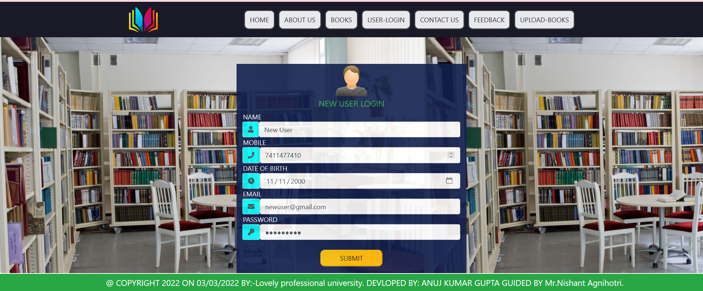

 
<h1>Php Library Management System</h1>
 <b>It’s a complete Library Management System built in Php. This
Library Management System is a computerized system that allows the
admin to access the library and manage accordingly first admin have
to login them self and after that admin manage the whole library they
can issue the book to any student and maintain their record . and he
can also add book if any book comes in stock and admin can change 
our profile if I say in a word that this project is complete library
management for any library admin can handle whole the thing by
digitally they no need to register copy and file. My project library
management system is build in by using Html5, Css3, JavaScript,
Bootstrap, MySql database and Php.
</b> 
 <h2> Quick Start </h2>
 <b>db ---></b> it is database folder  
 <b>for admin login ---></b> admin.php 
 <b>id---> </b>anujgupta5686@gmail.com 
  <b>password --></b> Hello@123   

# That's all 🎊🎉 

## ScreenShots
   
   
   
   
   
   
   
   
   
   
   
   
   
   
   
   

# Thanks
  
  
